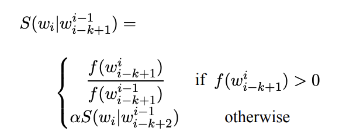
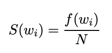

```{r setup, include=FALSE}
knitr::opts_chunk$set(echo = TRUE)
```

## Synopsis

Around the world, people are spending an increasing amount of time on their mobile devices for email, social networking, banking and a whole range of other activities. But typing on mobile devices can be a serious pain. The goal of this project is to learn and build predictive text models in R.

In this project, the stupid backoff algorithm will be used to build a predictive text model. The model will predict the next word based on a certain score and it will output several possibilities based on the number of suggestions the user wants. A Shiny application will be created with this model. When the user types in some words, the model will give some predictions for the next word and a wordcloud of predictions will be displayed on screen.

Relevant links:

**Shiny Application : ** https://nchin212.shinyapps.io/word_prediction_app/

**Pitch Presentation : ** https://nchin212.github.io/Coursera_Data_Science_Capstone_Project/pitch_presentation/pitch_presentation.html

**Github Repository : ** https://github.com/nchin212/Coursera_Data_Science_Capstone_Project

## Data

The data is downloaded from Coursera and can be obtained [here](https://d396qusza40orc.cloudfront.net/dsscapstone/dataset/Coursera-SwiftKey.zip). The data is from a corpus called HC Corpora. The zip file contains 4 folders, which are "en_US", "de_DE", "ru_RU" and "fi_FI". Only "en_US" contains English text so it was utilised for this project. It contains 3 text files: blogs, news and twitter. 

## Stupid Backoff Model

Before we dive into the data, it is essential to understand the model we will be using for prediction. Stupid backoff computes a score rather than a probability for ngrams on very large datasets. The score is calculated as follows:

```{r, echo=FALSE, fig.align="center"}

```

where alpha is set to 0.4 and the recursion ends with the unigrams calculated as follows:

```{r, echo=FALSE, fig.align="center"}

```

Let's take a look at an example.

Suppose our input text ends with "a great" and we are only working with 1grams, 2grams and 3grams.

**Step 1 - Search for the 2gram input in the 3grams dataset : ** We first search in the 3grams dataset for the 3grams that start with the 2grams,"a great". Suppose 1 of those 3 grams is "a great day". The score for "day" is calculated by taking the count of "a great day" in the 3grams dataset divided by the count of "a great" in the 2grams dataset.

**Step 2 - Backoff to search for 1 gram input in the 2grams dataset : ** We next search in the 2grams dataset for the 2grams that start with the 1gram, "great". Suppose 1 of those 2 grams is "great week". The score for "week" is calculated by taking the count of "great week" in the 2grams dataset divided by the count of "great" in the 1grams dataset. To account for the backoff, alpha = 0.4 is multiplied to the result. 

**Step 3 - Give the most common words in the 1grams dataset : ** The scores for each unigram are calculated by taking their count divided by the total number of unigrams. To account for the backoff, 0.4**2 is multiplied to the result. 

The model will output the respective words and their scores and the word with the highest score is most likely to be the next word. 

## Data Cleaning

The datasets are first combined and we notice that there are over 4 million lines altogether. After several trials, 1% of the dataset appears to be a suitable sample. The sample is then split into training and validation sets. The training set is transformed into a corpus and tokenized. Numbers, symbols, punctuation, separators and social media tags are removed as they create unnecessary noise in the data. Stemming and removing stopwords are not done as it would affect the prediction accuracy.
Only 1grams, 2grams and 3grams dataframes are created due to computing limitations.

The dataframes contain the following columns:

- **prevword** - the previous word/words of the ngram (note that 1gram does not have this column)
- **nextword** - the last word of the ngram, which is the predicted next word
- **score** - the scores computed using stupid backoff

The stupid backoff scores for each ngram have been precomputed using the above algorithm. This will help to save computation time and the prediction model will be able to predict words faster.

The full data cleaning process can be seen in the following link:

**Data Cleaning : ** https://nchin212.github.io/Coursera_Data_Science_Capstone_Project/data_cleaning/data_cleaning.html

## Exploratory Data Analysis

Some exploratory data analysis is also done to check the number of lines and number of characters. Wordclouds are used to plot the most frequent 1grams, 2grams and 3grams.

The full exploratory data analysis process can be seen in the following link:

**Exploratory Data Analysis** : * https://nchin212.github.io/Coursera_Data_Science_Capstone_Project/exploratory_data_analysis/exploratory_data_analysis.html

## Modelling

The model we will be using is stupid backoff. The stupid backoff scores have already been computed for the 1grams, 2grams and 3grams dataframes so now all we have to do is to implement the algorithm itself. The procedure is as follows:

**Step 1 - Take the last 2 words of the user input : ** We have to also account for the cases where the user keys in only 1 word or no words at all.

**Step 2 - Implement the stupid backoff algorithm as seen above : ** We have to retrieve the scores and account for the backoff (alpha = 0.4) accordingly. If the user keys in no input, the most common words in the 1grams dataset will be predicted as the next word.

**Step 3 - Collate the scores and arrange them from highest to lowest : ** The word with the highest score is predicted to be the next most likely word. 

Load in functions from other file.
```{r, warning=FALSE, message=FALSE}
source('../word_prediction_app/functions.R')
source('../data_cleaning/data_cleaning.R')
```

The following functions will be used:

**fun.input** - Takes in the user input, tokenizes it and retrieves the last 2 words of the input text
**fun.predict** - Retrieves the possible next words and stupid backoff scores according to the algorithm seen above

The functions can be seen in the following link:

**Functions : ** https://github.com/nchin212/Coursera_Data_Science_Capstone_Project/blob/gh-pages/word_prediction_app/functions.R

The user inputs the text as follows:
```{r}
input_text <- 'a great'
```

The inputs will be tokenized and the last 2 words will be stored as separate strings. If the user enters only 1 word, input1 will be an empty string. If the user enter no words, input1 and input2 will be empty strings.
```{r}
input1 = fun.input(input_text)[1,]
input2 = fun.input(input_text)[2,]
input1
input2
```

We run the predict function and retrieve 5 predictions, i.e. the top 5 words with the highest scores.
```{r}
number_pred <- 5
fun.predict(input1, input2)
```

As seen above, "time" has the highest score of 0.107, followed by "day" and "weekend". The predicted words appear to be fairly accurate.

## Accuracy

To determine its accuracy, we run the model on the validation set prepared during the data cleaning process.

```{r, warning=FALSE, message=FALSE}
source('../validation/validation.R')
```

The full validation process can be seen in the following link:

**Validation : ** https://github.com/nchin212/Coursera_Data_Science_Capstone_Project/blob/gh-pages/validation/validation.R

The accuracy table is printed as follows:
```{r}
accuracy_table
```

Here, accuracy means the percentage of cases where the correct word is predicted within the defined number of predicted words.
The table shows that the model is able to predict the next word relatively accurately with an accuracy of 0.68 when there are 5 predictions and using 2 previous words. The model does not do well when there is only 1 prediction and using 1 previous word.

Perhaps other models such has Katz's backoff model and BERT could be implemented to give a better result. Smoothing techniques such as Kneeser-Ney smoothing may also improve the accuracy. 

## Challenges

This section describes the challenges faced during this project.

**Challenge 1 - NLP is not easy : ** This was my first project on natural language processing and I had barely any knowledge of it. This course had a hands off approach so I had to do much research independently. It took several weeks but it was an interesting experience. Natural language processing is a huge field and little did I know that there were this many NLP libraries developed in R. 

**Challenge 2 - Memory : ** Due to the dataset containing millions of lines, it was difficult to determine a suitable sample size as I had to balance between sample size and prediction accuracy of the model. Certain functions in R used up more memory as compared to others and slow computation time was an issue several times. The stupid backoff score computation and retrieval of the scores also got more computationally intensive for 4grams and 5grams so I had to leave them out. Thus, this project has taught me to consider computer memory when working on large datasets.

## Final Thoughts

Overall, this was a very rewarding project as I had gained much knowledge on the aspects of word prediction and I was very satisfied with the final application designed. If you have made it this far, thank you for taking the time to read through my project! Many thanks to Coursera for providing me this opportunity to try out a new field.
