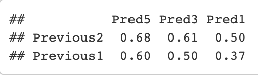
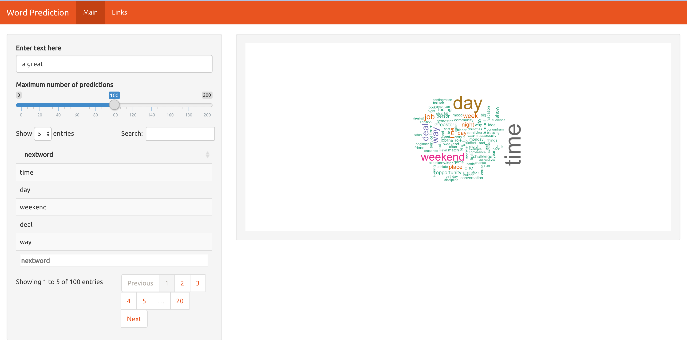

Word Prediction
========================================================
author: Nicholas Chin Wei Lun
date: 2 November 2020
autosize: true

The task for this project is to build a predictive text model in R and deploy it by building a Shiny application
for word prediction. This presentation provides a brief overview of the project and usage of the application.

Project Overview
========================================================
Data - Taken from a corpus called HC Corpora, consists of blogs,news and twitter text

Model - Stupid Backoff Model, more details can be seen [here](https://www.aclweb.org/anthology/D07-1090.pdf)

Accuracy - Achieved an accuracy of 0.68 for prediction based on the previous 2 words and 5 predictions given

Application Layout
========================================================

Application Usage
========================================================

1. The user types in some text in the text box 

2. The application displays the predicted words in the table, arranged from highest score to lowest score, where the word at the top is the highest possibility of being the next word

3. The application also displays the word cloud of the predicted words according to their score

4. The user is able to use the slider to select the number of words predicted and can also search for words in the table by typing into the search text box

Links
========================================================

Here are some relevant links for the project:

Shiny Application - https://nchin212.shinyapps.io/word_prediction_app/

Final Report - https://nchin212.github.io/Coursera_Data_Science_Capstone_Project/final_report/final_report.html

Github Repository - https://github.com/nchin212/Coursera_Data_Science_Capstone_Project
